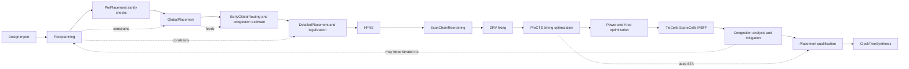
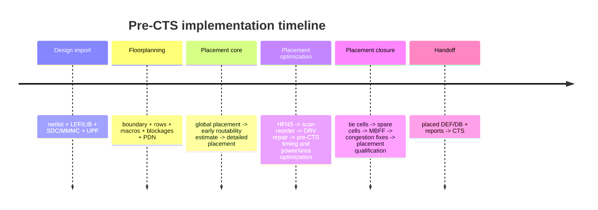
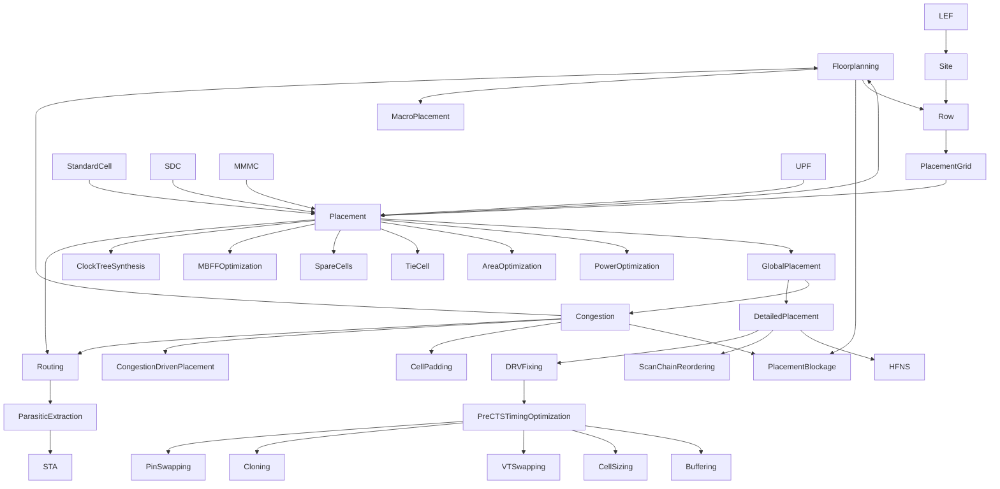

# Placement concept synthesis from L7 L8 and the floorplanning concept map

## Executive summary

The two placement lecture decks together define **Placement** much more broadly than “put standard cells on rows.” In these files, Placement is a **pre-CTS implementation and optimization package** that starts from a validated floorplan DB, performs legal standard-cell placement on sites/rows, estimates routability with early global routing, improves timing/power/area, fixes electrical design-rule violations, handles DFT-driven physical cleanup such as scan reorder and tie-cell usage, analyzes congestion, and hands off a qualified placed database to CTS. The lecture structure explicitly groups **global placement**, **detailed placement**, **HFNS**, **scan chain reordering**, **DRV fixing**, **pre-CTS timing optimization**, **power/area optimization**, **tie-cells**, **spare cells**, **MBFF optimization**, and **congestion analysis/mitigation** under the placement package before CTS. fileciteturn0file1 fileciteturn0file2

A clean scope split for Obsidian is this. **Inside Placement**: `[[Placement]]`, `[[StandardCell]]` as the movable object, `[[Site]]`, `[[Row]]`, legal orientation, placement area, density, placement blockage and padding, global placement, legalization/detailed placement, HFNS, scan chain reordering, DRV repair, pre-CTS optimization, power/area optimization, tie-cell insertion, spare cells, MBFF optimization, congestion analysis, and congestion-driven placement. **Outside but strongly related**: `[[Floorplanning]]`, `[[MacroPlacement]]`, `[[LEF]]`, `[[DEF]]`, `[[LIB]]`, `[[SDC]]`, `[[MMMC]]`, `[[UPF]]`, `[[RoutingGrid]]`, `[[Track]]`, `[[Pitch]]`, `[[MetalStack]]`, `[[STA]]`, `[[Slack]]`, `[[Slew]]`, `[[ClockSkew]]`, `[[ClockLatency]]`, `[[ClockUncertainty]]`, `[[ParasiticExtraction]]`, `[[SPEF]]`, `[[Routing]]`, `[[ClockTreeSynthesis]]`, and PG / EMIR checks. The floorplanning concept map also places `[[Placement]]` as the main downstream consumer of floorplan boundary, rows, macro constraints, blockages, and PDN decisions. fileciteturn0file0 fileciteturn0file1 fileciteturn0file2

The highest-value mental model is:
`Floorplanning shapes the legal search space; Placement optimizes within that space; CTS and Routing inherit Placement’s consequences.`  
That is consistent both with the uploaded materials and with public OpenROAD documentation and academic placement literature. OpenROAD documents global placement as analytic nonlinear optimization built on RePlAce, detailed placement as legalization to legal row/site locations, and design-repair utilities as the means to fix max slew, max capacitance, and max fanout after placement. Academic placement literature also treats **HPWL**, **density equalization**, and **minimal legalization movement** as the canonical placement objectives and quality metrics. citeturn2view0turn10view0turn10view2turn9view6turn6view0turn15view0

## Evidence base and assumptions

Primary evidence came from the uploaded lecture decks `L7-Placement_1` and `L8-Placement_2`, plus the uploaded floorplanning concept map, which already encodes the upstream/downstream relation between `[[Floorplanning]]` and `[[Placement]]`. fileciteturn0file1 fileciteturn0file2 fileciteturn0file0

External double-check used public official and academic sources only. The most important were OpenROAD documentation for **floorplan initialization**, **pin placement**, **global placement**, **detailed placement**, **gate resizing / repair**, **global routing**, **DFT**, and **tapcell/endcap insertion**, plus the **ePlace** paper and the **Abacus** legalization paper. These sources are suitable for verifying concepts and algorithms, but they do **not** prove one-to-one equivalence of every Cadence Innovus command shown in the Tresemi slides. In other words, the external sources validate the **conceptual flow**, not every tool-specific switch. citeturn3view0turn3view1turn2view0turn10view0turn9view6turn10view4turn17view0turn18view0turn6view0turn15view0

Assumptions used in this synthesis are explicit. First, when the lecture says “Placement,” I treat it as the **pre-CTS implementation stage** rather than the narrow mathematical step of only global legalization. That matches the outline of `L8`, which includes post-placement optimization under placement. Second, when the lecture gives heuristics such as density near `0.7` or overflow `< 1%`, I treat them as **practical starting points**, not universal laws; actual values depend on node, library architecture, macro density, PDN cost, and tool behavior. Third, several concepts appearing in the lectures do not yet appear in the user’s tree, so I recommend **new card filenames** for them rather than forcing them into unrelated existing cards. fileciteturn0file2 citeturn2view0turn10view4

## Placement boundary and flow map

Below is the clean boundary I recommend for AI-readable notes.

| Scope | Concepts | Recommended Obsidian location |
|---|---|---|
| Inside Placement | Placement, StandardCell, Site, Row, legal orientation, placement area, density, blockages, global placement, detailed placement, HFNS, scan reorder, DRV fix, pre-CTS optimization, power optimization, area optimization, tie cells, spare cells, MBFF, congestion and mitigation | `02_Concepts/PnR_Flow/Placement.md` plus new child cards where needed |
| Outside but required inputs | GateLevelNetlist, LEF, LIB, DEF, SDC, MMMC, UPF, PhysicalConstraints, Floorplanning, MacroPlacement, MetalStack | existing cards in `PnR_Flow`, `FileFormat`, `STA_Timing`, `TechnologyFile` |
| Outside but placement-adjacent analyses | RoutingGrid, Track, Pitch, early global routing, congestion metrics, STA metrics, OCV, CPPR, RC extraction, power reports, EMIR, clock reports | existing cards where available; new cards only if the concept is used repeatedly |

This is the flow that best matches the lecture decks. fileciteturn0file1 fileciteturn0file2

And this is the timing of major handoffs:

The floorplanning concept map reinforces the same dependency: floorplanning defines core boundaries, rows, macro FIXED locations, blockages, and PDN; placement consumes those constraints and then becomes the direct predecessor to CTS and Routing. fileciteturn0file0

## Inside Placement concepts

The format below is intentionally card-friendly.

**`[[Placement]]`**  
Suggested card: `02_Concepts/PnR_Flow/Placement.md`  
Bản chất: assigns physical `(x,y)` locations to standard cells inside the legal core placement region and optimizes the netlist for better PPA before CTS.  
Position in flow: after `[[Floorplanning]]`, before `[[ClockTreeSynthesis]]`.  
Inputs: logical netlist, floorplan DB / DEF, LEF abstracts, Liberty timing/power models, SDC/MMMC setup, optional UPF for power-domain legality.  
Outputs: placed design DB, usually a placed DEF plus updated netlist and reports.  
Key metrics and formulas: HPWL is the canonical fast wirelength proxy, `HPWL(net) = (xmax - xmin) + (ymax - ymin)`; density is a second core metric; timing and congestion are the main QoR views.  
Trade-offs: lower HPWL can worsen local density; aggressive timing optimization can increase area, power, and runtime; aggressive congestion spreading can lengthen critical paths.  
Bidirectional links: upstream `[[Floorplanning]]`; downstream `[[ClockTreeSynthesis]]`, `[[Routing]]`, `[[STA]]`; reciprocal link is that poor post-placement congestion/timing often forces floorplan iteration.  
Debug / reports: `check_place`, congestion map, placement utilization, timing summary, QoR summary, area/power reports. Common failure modes are illegal cells, high congestion, WNS/TNS collapse, and over-buffering. fileciteturn0file1 fileciteturn0file2 citeturn2view0turn20view0

**`[[StandardCell]]`**  
Suggested card: `02_Concepts/CellLibrary/StandardCell.md`  
Bản chất: pre-characterized logic primitive with fixed height and variable width, aligned to standard-cell rows; may have multiple height variants.  
Position in flow: the primary movable object of placement.  
Inputs: LEF abstract, LIB timing/power view, netlist instance, row/site architecture.  
Outputs: legal placement coordinates and later routing parasitics.  
Key metrics and formulas: width is an integer multiple of site width; legal placement requires row/site alignment.  
Trade-offs: higher-drive or lower-VT cells improve timing but usually cost more leakage/area; pin-dense cells increase local routing demand.  
Links: depends on `[[CellAbstract]]`, `[[Site]]`, `[[Row]]`; used by `[[Placement]]`, `[[STA]]`, `[[Routing]]`.  
Debug / reports: cell overlap, off-row placement, excessive pin density, cell padding need, bad VT mix. fileciteturn0file1

**`[[Site]]`**  
Suggested card: `02_Concepts/LEF_Geometry/Placement_subgroup/Site.md`  
Bản chất: minimum placement grid unit defined by technology / library; the atomic legal tile for standard-cell alignment.  
Position in flow: floorplan-derived infrastructure consumed directly by placement.  
Inputs: Tech LEF / library site definition.  
Outputs: row construction and legal-site snapping during legalization.  
Key metrics and formulas: site width and height define placement granularity; larger cells span multiple sites.  
Trade-offs: finer site granularity gives flexible packing but still must stay aligned to routing/power architecture.  
Links: upstream `[[LEF]]`; downstream `[[Row]]` and `[[PlacementGrid]]`; reciprocal relation is that row structure is impossible without site semantics.  
Debug / reports: off-site placement, incompatible multi-height cells, row/site mismatch. fileciteturn0file1 citeturn3view0

**`[[Row]]`**  
Suggested card: `02_Concepts/LEF_Geometry/Placement_subgroup/Row.md`  
Bản chất: a legal horizontal strip of adjacent sites where standard cells can be placed; adjacent rows alternate orientation to align power rails and support legal abutment.  
Position in flow: generated in floorplanning, enforced in detailed placement / legalization.  
Inputs: site definition, core area, floorplan.  
Outputs: legal row coordinates and row orientation pattern.  
Key metrics and formulas: row count and row width define legal placement capacity; row fragmentation reduces usable area.  
Trade-offs: fragmented rows around macros preserve macro integration but hurt effective placement freedom.  
Links: upstream `[[Site]]`, `[[Floorplanning]]`; downstream `[[PlacementGrid]]`, `[[Placement]]`.  
Debug / reports: missing or cut rows, mixed-height incompatibility, broken row continuity near macros. fileciteturn0file1 citeturn3view0

**Legal orientation**  
Suggested card: new `02_Concepts/LEF_Geometry/Placement_subgroup/PlacementOrientation.md`  
Bản chất: only certain cell orientations are legal, e.g. `R0`, `MY`, `MX`, `R180`, because row power-rail and well alignment must remain valid.  
Position in flow: checked during placement and legalization.  
Inputs: row orientation, library symmetry, cell legality rules.  
Outputs: legal instance orientation.  
Metrics / formulas: no central scalar formula; legality is binary.  
Trade-offs: mirroring helps HPWL locally but must preserve rail/well legality.  
Links: `[[StandardCell]]`, `[[Site]]`, `[[Row]]`, `[[Placement]]`.  
Debug: illegal orientation, rail mismatch, abutment issues. `optimize_mirroring` exists in OpenROAD specifically to reduce HPWL after placement. fileciteturn0file1 citeturn20view2

**Placement area and legal placement region**  
Suggested card: either fold into `[[Placement]]` or new `02_Concepts/PnR_Flow/StandardCellPlacementArea.md`  
Bản chất: the core sub-region where standard cells are allowed; placement never escapes it.  
Position in flow: inherited from floorplanning.  
Inputs: floorplan core boundary, macro footprints, blockages, row generation.  
Outputs: effective placeable area.  
Metrics: legal placeable area, row area, blocked fraction.  
Trade-offs: shrinking placeable area raises effective utilization and congestion.  
Links: `[[Floorplanning]]` ↔ `[[Placement]]`; `[[PlacementBlockage]]`, `[[MacroPlacement]]`.  
Debug: unplaced cells, legal area too small, macro-cut row slivers. fileciteturn0file1 fileciteturn0file0

**Placement density**  
Suggested card: new `02_Concepts/PnR_Flow/PlacementDensity.md`  
Bản chất: fraction of placeable area occupied by cells. The lecture distinguishes cell density and core density.  
Position in flow: used during global placement and congestion control.  
Inputs: total standard-cell area, macro area, placeable area.  
Outputs: density target and density map.  
Metrics and formulas: `cell_density = std_cell_area / placeable_area`; `core_density = (std_cell_area + macro_area) / placeable_area`. The lecture uses a practical placement density target below about `70%`, and OpenROAD global placement defaults target density to `0.7`.  
Trade-offs: higher density improves area efficiency but worsens routability and optimization freedom; lower density improves routability but costs die area.  
Links: `[[Placement]]`, `[[Congestion]]`, `[[Floorplanning]]`, `[[CoreArea]]`.  
Debug / reports: `report_placement_utilization`, density heatmap, local hotspots, high overflow in routing estimate. fileciteturn0file1 fileciteturn0file2 citeturn2view0

**`[[PlacementBlockage]]` and cell padding**  
Suggested card: new `02_Concepts/PnR_Flow/PlacementBlockage.md`; padding can be folded into it or split into `CellPadding.md`  
Bản chất: restricts legal placement in specific regions; hard, partial, and soft forms appear in the lecture. Padding is a finer-grain local keep-out around selected cells or masters to leave routing room.  
Position in flow: floorplan-originated but also used later during congestion mitigation.  
Inputs: macro locations, congestion map, routability intent.  
Outputs: modified legal search space.  
Metrics: blocked area fraction, allowed utilization in partial blockage, padding in site counts.  
Trade-offs: too much blockage/padding wastes area; too little causes severe hotspots.  
Links: `[[Floorplanning]]`, `[[MacroPlacement]]`, `[[Congestion]]`, `[[RoutingBlockage]]`, `[[Placement]]`.  
Debug / reports: hotspot persistence near macros, pin-access failures, artificial whitespace, unexpected utilization increase. OpenROAD documents `set_placement_padding` in row-site units specifically to leave room for routing. fileciteturn0file1 fileciteturn0file2 citeturn10view3

**Pre-placement sanity checks**  
Suggested card: new `02_Concepts/PnR_Flow/PrePlacementSanityChecks.md`  
Bản chất: readiness gate before moving cells.  
Position in flow: first sub-step of placement.  
Inputs: floorplan DB, PG connectivity, macro locks, IO/pin placement, rows, MMMC, constraints.  
Outputs: go / no-go decision, issue list.  
Metrics: placement legality, PG connectivity, DRC short-only hygiene, congestion sanity, utilization sanity.  
Trade-offs: more checking costs runtime but prevents meaningless optimization on a broken DB.  
Links: `[[Floorplanning]]`, `[[Placement]]`, `[[PowerAnalysis]]`, `[[SDC]]`, `[[MMMC]]`.  
Debug / reports: `check_floorplan`, `check_drc`, `verify_pg_nets`, `check_design -type place`, `report_congestion`, `report_placement_utilization`. Common failures are unfixed macros, missing rows, PG mismatch, broken power domains, and impossible utilization. fileciteturn0file1 fileciteturn0file2

**Global placement**  
Suggested card: new `02_Concepts/PnR_Flow/GlobalPlacement.md`  
Bản chất: coarse analytic placement that optimizes wirelength, density, and often timing/routability before strict legalization. Temporary overlap is allowed.  
Position in flow: after sanity checks, before detailed placement.  
Inputs: netlist, floorplan constraints, row/site model, congestion estimator, timing model, wire RC estimate.  
Outputs: approximate coordinates, density distribution, preliminary congestion/timing QoR.  
Metrics and formulas: HPWL, overflow, density, timing-critical net weights, target density. OpenROAD describes global placement as analytic nonlinear optimization based on RePlAce and documents timing-driven net weighting and routability-driven cell inflation.  
Trade-offs: timing-driven mode improves critical nets but increases runtime; routability-driven spreading lowers congestion but may lengthen some paths; more iterations improve QoR but cost runtime.  
Links: `[[Placement]]`, `[[Congestion]]`, `[[STA]]`, `[[Routing]]`, `[[DetailedPlacement]]`.  
Debug / reports: congestion heatmap, HPWL trend, density divergence, over-spreading, unstable critical-path movement. fileciteturn0file1 citeturn2view0turn6view0

**Early global routing and routability metrics**  
Suggested card: fold into `[[Placement]]` or new `02_Concepts/PnR_Flow/EarlyGlobalRouting.md` and `Congestion.md`  
Bản chất: coarse routing estimate during placement to predict whether the current placement is routeable. The lecture uses GCELL-based early routing and overflow metrics.  
Position in flow: after or during global placement, before handoff to detailed placement / congestion fixes.  
Inputs: global-placement solution, routing grid, layer directions, track capacity.  
Outputs: congestion map, overflow scores, hotspot locations, routeability judgment.  
Metrics and formulas: congestion exists when required routing demand exceeds available routing tracks; overflow is the excess demand measure; the lecture uses a practical heuristic that overflow below about `1%` is generally routable. OpenROAD says routability-driven placement can use faster RUDY or more accurate FastRoute-based checks.  
Trade-offs: more accurate routability analysis costs runtime; routing-friendly spreading may hurt HPWL/timing.  
Links: `[[GlobalPlacement]]` ↔ `[[Routing]]`; also linked to `[[RoutingGrid]]`, `[[Track]]`, `[[Pitch]]`, `[[PlacementBlockage]]`.  
Debug / reports: `route_early_global`, `report_congestion`, hotspot reports, density map. fileciteturn0file1 fileciteturn0file2 citeturn2view0turn10view4

**Detailed placement and legalization**  
Suggested card: new `02_Concepts/PnR_Flow/DetailedPlacement.md`  
Bản chất: converts overlapping global-placement coordinates into legal row/site-aligned locations and then performs small local improvements.  
Position in flow: immediately after global placement.  
Inputs: global-placement coordinates, rows/sites, blockages, fence regions, max displacement rules.  
Outputs: legal coordinates written back to DB.  
Metrics and formulas: total movement from global placement, max displacement, legality status. OpenROAD documents legalization engines, mixed-cell-height support, fence-region support, and `check_placement`; Abacus literature formalizes legalization as minimal-movement row alignment.  
Trade-offs: minimal movement preserves GP QoR but may miss local wirelength improvements; stronger local optimization improves HPWL but may disturb timing/routability balance.  
Links: `[[GlobalPlacement]]`, `[[PlacementGrid]]`, `[[Row]]`, `[[Site]]`, `[[Routing]]`.  
Debug / reports: overlaps, illegal row assignment, fragmented-row failures, mixed-height incompatibility, failed `check_place`. fileciteturn0file1 citeturn10view0turn10view2turn20view0turn15view0

**HFNS**  
Suggested card: new `02_Concepts/PnR_Flow/HFNS.md`  
Bản chất: high-fanout net synthesis for nets such as reset, scan enable, and other control signals; inserts buffering structure to distribute one source to many sinks.  
Position in flow: after detailed placement in the lecture flow, before or around scan reorder and further optimization.  
Inputs: high-fanout nets, current placement, fanout constraints, timing/electrical objectives.  
Outputs: buffered and physically sensible high-fanout trees.  
Metrics: fanout count, transition, capacitance, insertion count, added area/power.  
Trade-offs: buffering improves slew and delay distribution but adds area, dynamic power, leakage, and runtime.  
Links: `[[Placement]]`, `[[MaxFanout]]`, `[[MaxTransition]]`, `[[PreCTSTimingOptimization]]`.  
Debug / reports: long control nets, max fanout or slew violations persisting on control structures, excessive repeater insertion. fileciteturn0file1

**Scan chain reordering**  
Suggested card: new `02_Concepts/PnR_Flow/ScanChainReordering.md`  
Bản chất: physical reorder of scan-chain flop sequence after placement to minimize scan-wirelength and improve test routing practicality.  
Position in flow: after placement when real flop locations are known.  
Inputs: scan DEF / scan topology, placed flop coordinates, DFT intent.  
Outputs: reordered scan stitching.  
Metrics: scan wirelength, chain balance, chain count/length, test-mode routability.  
Trade-offs: better physical order lowers wirelength and congestion but must preserve DFT correctness and chain architecture constraints.  
Links: `[[Placement]]`, `[[DFT]]`, `[[StandardCell]]`, `[[Routing]]`. Bidirectional note: DFT architecture constrains reordering; placement supplies the geometry that makes reordering meaningful.  
Debug / reports: `trace_scan`, `report_scan_chain`, `check_scan_chain`. OpenROAD’s DFT docs also distinguish `scan_replace` before placement from chain architecture after global placement / after placement to minimize wirelength. fileciteturn0file1 fileciteturn0file2 citeturn17view0

**DRV fixing**  
Suggested card: new `02_Concepts/PnR_Flow/DRVFixing.md`  
Bản chất: repairs electrical rule violations after placement, especially max capacitance, max transition, and max fanout.  
Position in flow: post-placement, pre-CTS.  
Inputs: placed netlist, estimated parasitics from placement, library limits, SDC constraints.  
Outputs: repaired netlist / DB with inserted buffers or resized cells.  
Metrics and formulas: max cap, max slew, max fanout violation counts; repair count; area/power overhead. OpenROAD `repair_design` explicitly targets these three classes and long wires, using placement-based parasitics as the estimate.  
Trade-offs: fixing DRVs adds cells and can perturb timing, area, power, and congestion; under-fixing leaves CTS and routing on an unstable base.  
Links: `[[Placement]]`, `[[Slew]]`, `[[NetDelay]]`, `[[Slack]]`, `[[LIB]]`.  
Debug / reports: `report_constraint -all_violators`, timing summary, area delta, power delta, repair logs. fileciteturn0file1 fileciteturn0file2 citeturn9view6turn9view7turn9view8

**Max capacitance, max transition, max fanout**  
Suggested cards: new `02_Concepts/STA_Timing/MaxCapacitance.md`, `MaxTransition.md`, `MaxFanout.md` or fold into `DRVFixing.md`  
Bản chất: electrical constraints that cap allowed load, slew, and sink count respectively.  
Position in flow: enforced during post-placement optimization and later again after routing.  
Inputs: LIB rules, SDC constraints, estimated or extracted parasitics.  
Outputs: violation reports and repair actions.  
Metrics: violation count, worst violator magnitude, net length, fix count.  
Trade-offs: strict limits improve electrical health and timing robustness but increase buffering/sizing overhead.  
Links: `[[DRVFixing]]`, `[[Slew]]`, `[[NetDelay]]`, `[[LIB]]`, `[[STA]]`.  
Debug / reports: max-cap, max-transition, and max-fanout violator reports; repair buffer insertion logs. fileciteturn0file1 citeturn9view6turn9view8

**Pre-CTS timing optimization**  
Suggested card: new `02_Concepts/PnR_Flow/PreCTSTimingOptimization.md`  
Bản chất: timing repair before clock-tree insertion, still based on estimated placement/global-route parasitics.  
Position in flow: after DRV cleanup, before CTS.  
Inputs: placed DB, estimated RC, SDC/MMMC/OCV/CPPR settings, path groups.  
Outputs: improved WNS/TNS and a more CTS-ready design.  
Metrics: WNS, TNS, violating endpoint count, path-group health.  
Trade-offs: aggressive pre-CTS optimization can add many cells and distort later CTS; too little optimization hands CTS an already failing design.  
Links: `[[Placement]]`, `[[STA]]`, `[[ClockTreeSynthesis]]`, `[[Slack]]`, `[[MMMC]]`, `[[OCV]]`, `[[CPPR]]`, `[[PathGrouping]]`.  
Debug / reports: `report_timing -summary`, `time_design -pre_cts`, group-path diagnostics, QoR and area/power reports. fileciteturn0file1 fileciteturn0file2

**Buffering, cell sizing, VT swapping, logic restructuring, cloning, pin swapping**  
Suggested cards: fold into `PreCTSTimingOptimization.md` or split into new cards if you want granular optimization vocabulary.  
Bản chất: the lecture treats these as the canonical local optimization moves. Buffering inserts repeater stages; cell sizing changes drive strength; VT swapping changes threshold flavor; logic restructuring changes logic form; cloning replicates drivers to reduce load; pin swapping reassigns equivalent pins to reduce delay/capacitance.  
Position in flow: mainly pre-CTS timing optimization; some also appear in power optimization.  
Inputs: timing report, violation root cause, library alternatives, local placement context.  
Outputs: changed netlist/instance choices.  
Metrics and formulas: WNS/TNS movement, transition/cap/load improvements, area delta, leakage delta, dynamic-power delta. The lecture’s power formulas are `Pswitch = αCV²f`, `Pshort ≈ Isc·V·tsc·f`, `Pleak = V·Ileak`, and `Ptotal = Pstatic + Pdynamic`.  
Trade-offs:  
Buffering — improves electrical behavior but adds area/power/congestion.  
Cell sizing — improves delay/transition but increases cap and power.  
VT swapping — LVT improves timing but hurts leakage; HVT saves leakage but slows paths.  
Logic restructuring — can reduce depth or area but changes topology.  
Cloning — reduces load and can fix fanout, but adds area and duplicate power.  
Pin swapping — low-cost local improvement, but only for functionally equivalent pins.  
Links: `[[Placement]]`, `[[STA]]`, `[[LIB]]`, `[[Slack]]`, `[[Slew]]`, `[[PowerAnalysis]]`.  
Debug / reports: timing deltas, leakage/dynamic power changes, over-buffered nets, local congestion, unexpected area growth. OpenROAD also documents post-placement optimization aids such as `optimize_mirroring` and `improve_placement` for incremental HPWL/local improvement. fileciteturn0file1 fileciteturn0file2 citeturn20view2turn20view3

**Power optimization inside placement**  
Suggested card: new `02_Concepts/PnR_Flow/PlacementPowerOptimization.md` or fold into `Placement.md`  
Bản chất: uses placement-aware wirelength reduction, cell choice, VT choice, and clock gating awareness to reduce power before CTS.  
Position in flow: post-placement optimization.  
Inputs: activity annotation, library power models, placed netlist, timing slack margin.  
Outputs: lower estimated dynamic/leakage power without violating timing.  
Metrics and formulas: switching, internal, and leakage power; total design power; block/hierarchy power.  
Trade-offs: lower power often conflicts with timing or area; pushing HVT too hard can destroy slack.  
Links: `[[Placement]]`, `[[PowerAnalysis]]`, `[[StandardCell]]`, `[[ClockGating]]`, `[[Slack]]`.  
Debug / reports: `report_power`, hierarchy power, VT-mix inspection, switching-activity coverage. fileciteturn0file2

**Area optimization**  
Suggested card: new `02_Concepts/PnR_Flow/PlacementAreaOptimization.md`  
Bản chất: downsizes cells, removes unneeded buffers/inverters, and recovers whitespace when timing margin allows.  
Position in flow: post-placement optimization.  
Inputs: placed design with timing slack margin.  
Outputs: smaller area and often reduced leakage.  
Metrics: total cell area, gate count, whitespace, utilization, slack reserve consumed.  
Trade-offs: area recovery is valuable only until it begins to damage timing or routability.  
Links: `[[Placement]]`, `[[Slack]]`, `[[PowerAnalysis]]`, `[[PlacementDensity]]`.  
Debug / reports: `report_area -summary`, `report_area -hierarchy`, `report_gate_count`, regression of WNS/TNS after downsizing. fileciteturn0file2

**Tie cells and tie-cell insertion**  
Suggested card: new `02_Concepts/PnR_Flow/TieCell.md`  
Bản chất: specialized cells used instead of tying gates directly to raw `1’b0` / `1’b1`; they protect gate oxide and distribute constants safely.  
Position in flow: commonly inserted during or after placement cleanup.  
Inputs: constant nets, library tie-high/tie-low cells, max-fanout policy.  
Outputs: netlist with constant nets driven by tie cells.  
Metrics: tie-cell count, tie fanout, separation, verification connectivity.  
Trade-offs: more tie cells cost area but improve reliability and electrical cleanliness.  
Links: `[[Placement]]`, `[[LIB]]`, `[[DRVFixing]]`, `[[StandardCell]]`.  
Debug / reports: `report_tieoffs`, connectivity check, tie-fanout repair. OpenROAD documents both tie-cell insertion and tie-fanout repair as explicit commands. fileciteturn0file2 citeturn3view0turn9view5

**Spare cells**  
Suggested card: new `02_Concepts/PnR_Flow/SpareCells.md`  
Bản chất: pre-inserted spare logic left unused initially so later ECOs can be implemented locally without major re-placement.  
Position in flow: post-placement preparation for future ECO resilience.  
Inputs: ECO strategy, spare-cell mix, distribution strategy.  
Outputs: placed spare instances distributed across layout.  
Metrics: spare count, spatial spacing, area overhead, ECO reachability.  
Trade-offs: improves ECO flexibility but consumes area and can slightly affect congestion.  
Links: `[[Placement]]`, `[[Signoff]]`, ECO flow, `[[AreaOptimization]]`.  
Debug / reports: spare distribution clustering, inaccessible spare islands, unexpected blockage of routing resources. This concept is present in the lecture, but public official corroboration is weaker than for global/detailed placement; treat the slide content as the main source. fileciteturn0file2

**MBFF optimization**  
Suggested card: new `02_Concepts/PnR_Flow/MBFFOptimization.md`  
Bản chất: merges compatible single-bit or smaller flops into larger multi-bit flip-flops to reduce clock-tree load, area, and often power.  
Position in flow: post-placement optimization, still before CTS.  
Inputs: placed flops, clock compatibility, library MBFF options, timing constraints.  
Outputs: replaced register instances and updated placement.  
Metrics: MBFF count, area delta, clock-network power delta, timing impact.  
Trade-offs: MBFF can reduce clock power and area but may worsen local placement flexibility, pin access, or ECO convenience.  
Links: `[[Placement]]`, `[[ClockTreeSynthesis]]`, `[[PowerAnalysis]]`, `[[StandardCell]]`.  
Debug / reports: `report_multibit`, hold/setup regressions around merged registers, placement accessibility problems. External public validation for the exact lecture procedure is limited, so keep this card marked as lecture-derived until you add a dedicated paper or vendor manual. fileciteturn0file2

**Congestion and congestion mitigation**  
Suggested card: new `02_Concepts/PnR_Flow/Congestion.md`  
Bản chất: routing demand exceeding routing supply in a region. The lecture explicitly frames congestion as a placement problem first, not only a routing problem.  
Position in flow: analyzed during and after global placement and revisited during post-placement optimization.  
Inputs: placed cells, routing tracks, layer directions, pin density, macro geometry, PG usage.  
Outputs: congestion map, hotspot list, mitigation actions.  
Metrics and formulas: overflow score, hot-spot count, density map, routeability estimate.  
Trade-offs: congestion reduction may require more whitespace, longer wires, lower utilization, or even floorplan change.  
Links: `[[Placement]]`, `[[Routing]]`, `[[RoutingGrid]]`, `[[Track]]`, `[[Pitch]]`, `[[PlacementBlockage]]`, `[[Floorplanning]]`.  
Debug / reports: `route_early_global`, `report_congestion`, hotspot GUI, density map. Root causes named in the lecture include high density, macro pin density, narrow channels, cells near macros, and PG blockage. Mitigations include placement/routing blockages, halos, cell padding, congestion-driven placement, PG adjustment, floorplan change, and physically aware synthesis. fileciteturn0file2 citeturn2view0turn10view4

**Congestion-driven placement**  
Suggested card: new `02_Concepts/PnR_Flow/CongestionDrivenPlacement.md`  
Bản chất: places cells with routability objectives explicitly enabled, often by density shaping or cell inflation in congested tiles.  
Position in flow: global-placement mode or post-placement re-optimization mode.  
Inputs: congestion model, placement density, hotspot map.  
Outputs: spread placement with lower routing demand peaks.  
Metrics: routing-congestion metric, hotspot overflow, HPWL penalty, runtime.  
Trade-offs: better routability often costs HPWL, timing, or runtime. OpenROAD explicitly documents routability-driven placement using RUDY or FastRoute and cell inflation in congested tiles.  
Links: `[[GlobalPlacement]]`, `[[Congestion]]`, `[[Routing]]`.  
Debug / reports: congestion trend over iterations, failing RC target, diverging spread. fileciteturn0file2 citeturn2view0

**Placement outputs and qualification**  
Suggested card: fold into `[[Placement]]` or new `02_Concepts/PnR_Flow/PlacementOutputs.md`  
Bản chất: the handoff package to CTS.  
Position in flow: very end of placement stage.  
Inputs: final placed and optimized DB.  
Outputs: optimized netlist, optimized DEF, saved tool DB/checkpoint, timing/power/area/congestion reports.  
Metrics: legal placement, minimal residual DRVs, acceptable WNS/TNS, routeability, power within target, no early EMIR red flags, CTS-readiness.  
Trade-offs: over-optimizing for one metric at this point can destabilize another and trigger re-iteration.  
Links: `[[ClockTreeSynthesis]]`, `[[Routing]]`, `[[STA]]`, `[[PowerAnalysis]]`, `[[Floorplanning]]`.  
Debug / reports: `write_def`, `write_db`, timing summary, QoR, area, power hierarchy, congestion, clock reports. Common exit criteria in the lecture are “no DRV violations,” “all cells legally placed,” “minimal congestion,” “PPA requirements met,” and “ready for CTS.” fileciteturn0file2

## Outside but related concepts

These concepts are not Placement itself, but Placement cannot be understood without them.

**`[[Floorplanning]]`**  
Suggested card: existing `02_Concepts/PnR_Flow/Floorplanning.md`  
Placement consumes its outputs: legal core boundary, macro FIXED positions, rows, blockages, PDN, and pin/IO constraints. The floorplanning concept map already frames `[[Placement]]` as a downstream consumer and shows that bad placement QoR can force floorplan iteration. Bidirectional relation: floorplanning constrains placement; placement feedback validates or breaks the floorplan. fileciteturn0file0

**`[[GateLevelNetlist]]`, `[[LEF]]`, `[[LIB]]`, `[[DEF]]`, `[[SDC]]`, `[[MMMC]]`, `[[UPF]]`**  
Suggested cards: use the existing file-format and timing cards.  
These are the formal inputs. The lecture explicitly names netlist, physical libraries / LEF, floorplan / DEF, timing libraries, SDC, RC corners / MMMC, and UPF for multi-voltage designs as placement inputs. Bidirectional relation: placement consumes them; later reports and DEF/DB snapshots externalize placement results back into file formats and timing contexts. fileciteturn0file1

**`[[RoutingGrid]]`, `[[Track]]`, `[[Pitch]]`, `[[MetalStack]]`**  
Suggested cards: existing `02_Concepts/LEF_Geometry/RoutingGrid/*` and `02_Concepts/TechnologyFile/MetalStack.md`  
These are outside placement but heavily referenced because routability is estimated during placement. The lecture explains preferred routing directions by layer, routing tracks, and track pitch. Bidirectional relation: routing resources constrain placement density and spreading; placement density determines routing demand. fileciteturn0file1 citeturn3view0turn10view4

**`[[STA]]`, `[[Slack]]`, `[[Slew]]`, `[[SetupTime]]`, `[[HoldTime]]`, `[[ClockSkew]]`, `[[ClockLatency]]`, `[[ClockUncertainty]]`, `[[MMMC]]`, `[[OCV]]`, `[[CPPR]]`, `[[PathGrouping]]`**  
Suggested cards: use existing timing cards where they exist; create `OCV.md`, `CPPR.md`, `PathGrouping.md` if missing.  
These are outside placement mathematically, but they are the language used to decide whether placement is good. The lecture explicitly covers WNS, TNS, OCV, CPPR, timing paths, and path grouping during pre-CTS optimization setup. Bidirectional relation: placement affects net delay and clock topology; STA metrics tell placement where to change cells. fileciteturn0file1

**`[[PowerAnalysis]]`, `[[ClockGating]]`, PG / EMIR**  
Suggested cards: existing `PowerAnalysis` if you have it; otherwise create `02_Concepts/PnR_Flow/PowerAnalysis.md` and optionally `ClockGating.md`.  
These are outside placement but deeply coupled. The lecture’s power section defines dynamic, internal, and leakage power, then shows placement-stage power optimization and requires no early IR-drop / EM red flags at signoff-style placement qualification. Bidirectional relation: placement changes wirelength, buffering, cell selection, and clock-tree burden; power analysis/EMIR feeds back whether the placed solution is safe. fileciteturn0file2

**`[[Routing]]`, `[[ClockTreeSynthesis]]`, `[[ParasiticExtraction]]`, `[[SPEF]]`**  
Suggested cards: existing.  
These are downstream consumers. CTS needs placed sink locations. Routing needs legal cell coordinates and enough whitespace/channels. Extraction and SPEF only become accurate after route, which is why pre-CTS placement uses estimated parasitics and margins. Bidirectional relation: poor placement harms CTS/routing; CTS/routing results are the eventual truth source that calibrates whether placement heuristics were valid. OpenROAD also notes that placement-based parasitics are only estimates and may need over-repair margins. fileciteturn0file1 fileciteturn0file2 citeturn9view6

## Card mapping, concept-link graph, and open questions

This is the shortest useful card map for your current tree.

| Concept in the lectures | Inside placement | Suggested Obsidian card |
|---|---|---|
| Placement | yes | `02_Concepts/PnR_Flow/Placement.md` |
| Standard Cell | yes | `02_Concepts/CellLibrary/StandardCell.md` |
| Site | yes | `02_Concepts/LEF_Geometry/Placement_subgroup/Site.md` |
| Row | yes | `02_Concepts/LEF_Geometry/Placement_subgroup/Row.md` |
| Placement Grid | yes | `02_Concepts/LEF_Geometry/Placement_subgroup/PlacementGrid.md` |
| Placement Density | yes | new `02_Concepts/PnR_Flow/PlacementDensity.md` |
| Placement Blockage | yes | new `02_Concepts/PnR_Flow/PlacementBlockage.md` |
| Global Placement | yes | new `02_Concepts/PnR_Flow/GlobalPlacement.md` |
| Detailed Placement | yes | new `02_Concepts/PnR_Flow/DetailedPlacement.md` |
| HFNS | yes | new `02_Concepts/PnR_Flow/HFNS.md` |
| Scan Chain Reordering | yes | new `02_Concepts/PnR_Flow/ScanChainReordering.md` |
| DRV Fixing | yes | new `02_Concepts/PnR_Flow/DRVFixing.md` |
| Pre-CTS Timing Optimization | yes | new `02_Concepts/PnR_Flow/PreCTSTimingOptimization.md` |
| Tie Cell | yes | new `02_Concepts/PnR_Flow/TieCell.md` |
| Spare Cells | yes | new `02_Concepts/PnR_Flow/SpareCells.md` |
| MBFF Optimization | yes | new `02_Concepts/PnR_Flow/MBFFOptimization.md` |
| Congestion | yes | new `02_Concepts/PnR_Flow/Congestion.md` |
| Cell Padding | yes | new `02_Concepts/PnR_Flow/CellPadding.md` or fold into `PlacementBlockage.md` |
| Floorplanning | no, upstream | `02_Concepts/PnR_Flow/Floorplanning.md` |
| RoutingGrid / Track / Pitch | no, related | existing `02_Concepts/LEF_Geometry/RoutingGrid/*` |
| LEF / DEF / LIB / SPEF | no, input-output format | existing `02_Concepts/FileFormat/*` |
| SDC / MMMC / Slack / Slew / OCV / CPPR | no, timing framework | existing timing cards plus new ones if missing |
| CTS / Routing / ParasiticExtraction | no, downstream | existing `02_Concepts/PnR_Flow/*` |

The cross-link graph below is the one I would use as the backbone of the Obsidian graph.

Open questions / limitations:

The lecture content is strongest on **flow practice** and **tool usage**, but weaker on formally separating where “placement proper” ends and where “pre-CTS physical optimization” begins. I resolved that by following the lecture outline itself: everything before CTS in `L8` remains under the placement package. `TieCell`, `SpareCells`, and `MBFFOptimization` are clearly present in the decks, but public official documentation is less complete for the exact commercial-flow usage than it is for global placement, legalization, and design repair; those cards should therefore be tagged as **lecture-derived, externally double-checked only at concept level** until you add vendor manuals or dedicated papers. Finally, the floorplanning concept map is conceptually useful for upstream/downstream linkage, but it is not a substitute for the actual placement lecture decks when you create placement cards. fileciteturn0file0 fileciteturn0file2